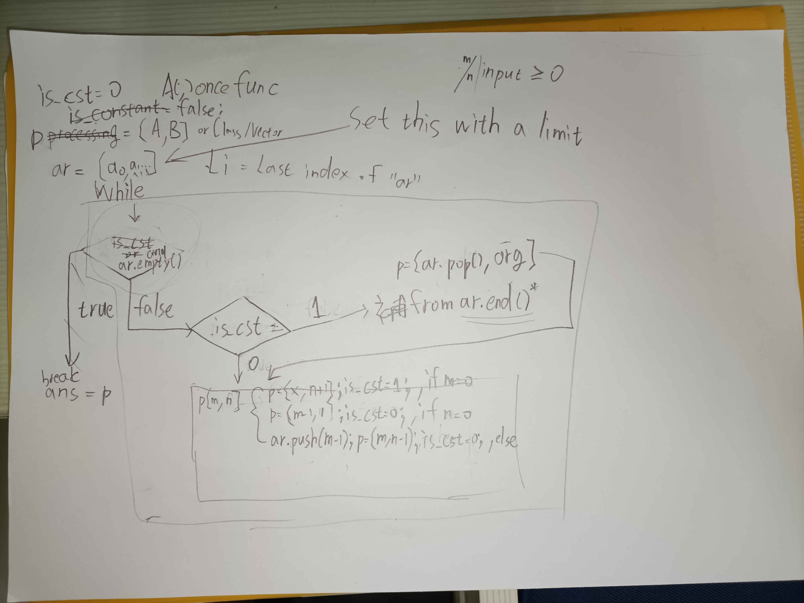

# 41343131

## 作業一

## 1. 問題 1 Ackermann's Function

### 1.1 解題說明

本題要求實現Ackermann函數，並且分別透過遞迴及非遞迴方式實現。

#### 1.1.1 解題策略

1. 遞迴:
    - 依照Ackermann定義直接寫出遞迴函式。

2. 非遞迴:
    - 觀察到遞迴函式中Ackermann函式會不斷呼叫自己並且呼叫時僅會在第二個參數位置額外呼叫Ackermann函式，因此我藉此設計一個 Vector(`processing[2]`) 以及一個 `is_constant` 常數標記(用於定義目前是否將 `processing[1]` 視為常數並忽略 `processing[0]` )作為計算 $A(m,n)$ 迭代所用暫存器。
    - 當條件一成立時，將 `processing` 中待處裡堆疊中取出一個資料繼續執行。
    - 當條件二成立時，只需照定義修改 `processing` 的值。
    - 當觸發條件三時，將原先的表達式 $A(m-1,A(m,n-1))$ 第一個參數排入待處裡堆疊(FILO)。

### 1.2 程式實作

1. 遞迴版本:

```cpp
#include <iostream>
using namespace std;

// by recursive
int A(int m, int n)
{
    if (!m)
        return n + 1;
    else if (!n)
        return A(m - 1, 1);
    else
        return A(m - 1, A(m, n - 1));
}

int main()
{
    int a, b;
    while (cin >> a >> b)
    {
        int ans = A(a, b);
        cout << "ans:" << ans << endl;
    }
    return 0;
}
```

2. 非遞迴(迭代)版本:

```cpp
#include <iostream>
#define MAX_STACK_NUM 200000
using namespace std;

// by non-recursive
int A_nr(int m, int n)
{
    bool is_constant = false;
    int processing[] = {m, n};
    int array[MAX_STACK_NUM];   // Lazy version
    int a_end = 0;
    while (true)
    {
        if (is_constant)
        {
            if (!a_end)
            {
                return processing[1];
            }
            else
            {
                processing[0] = array[a_end];
                --a_end;
                is_constant = false;
            }
        }
        else
        {
            if (!processing[0])
            {
                is_constant = true;
                ++processing[1];
            }
            else if (!processing[1])
            {
                --processing[0];
                processing[1] = 1;
            }
            else
            {
                ++a_end;
                array[a_end] = processing[0] - 1;
                --processing[1];
            }
        }
    }
}

int main()
{
    int a, b;
    while (cin >> a >> b)
    {
        int ans = A_nr(a, b);
        cout << "ans:" << ans << endl;
    }
    return 0;
}
```

### 1.3 效能分析

1. 遞迴版本:
   1. 時間複雜度:
    - $O(1)$ ，m = 0
    - $O(n)$ ，1 <= m <= 2
    - $O({\displaystyle (2\uparrow ^{m-2}(n+3))-3})$ ，m >= 3
   2. 空間複雜度:
    - $O(1)$ ，m = 0
    - $O(n)$ ，1 <= m <= 2
    - $O({\displaystyle (2\uparrow ^{m-2}(n+3))-3})$ ，m >= 3
2. 非遞迴版本:
   1. 時間複雜度: 同上
   2. 空間複雜度:
    - $O(1)$ ，使用固定陣列
    - $O({\displaystyle (2\uparrow ^{m-2}(n+3))-3})$ ，使用動態堆疊

### 1.4 測試與驗證

#### 1.4.1 測試案例

| 案例編號 | 輸入參數$m$ | 輸入參數$n$ | 預期輸出 | 實際輸出(遞迴版本) | 實際輸出(非遞迴版本) |
| - | - | - | ---------------------- | - |
| 1 | $m = 0$ | $n = 0$ | 1 | 1 | 1 |
| 2 | $m = 0$ | $n = 3$ | 4 | 4 | 4 |
| 3 | $m = 1$ | $n = 0$ | 2 | 2 | 2 |
| 4 | $m = 1$ | $n = 3$ | 5 | 5 | 5 |
| 5 | $m = 2$ | $n = 4$ | 11 | 11 | 11 |
| 6 | $m = 3$ | $n = 0$ | 5 | 5 | 5 |
| 7 | $m = 3$ | $n = 3$ | 61 | 61 | 61 |
| 8 | $m = 3$ | $n = 4$ | 125 | 125 | 125 |
| 9 | $m = 4$ | $n = 0$ | 13 | 13 | 13 |
| 10 | $m = 4$ | $n = 1$ | 65533 | 65533 | 65533 |
| 11 | $m = 4$ | $n = 2$ | ${2\uparrow \uparrow 5-3}$ | error | error |

#### 1.4.2 執行指令

```shell
$ 0 0
ans:1
$ 4 1
ans:65533
```

#### 1.4.3 結論

1. 在 $(m <= 2) \vee (m <= 3 \land n <= 14) \vee (m <= 4 \land n <= 1) \vee (m = 5 \land n = 0)$ 時正確運行。
2. 1.限定範圍外將出現錯誤(超過C/C++內建類型值上限、記憶體堆疊溢位)。

### 1.5 申論與開發報告

#### 1.5.1 設計的過程

遞迴的實現簡單直接，非遞迴則依靠了類堆疊的手段進行操作。

據觀察，在條件三發生時，若 $m - 1 = 0$ 出現，是有優化可能的。

若要計算更大的數則需要能存更大值的自訂類型(或程式庫)。

以下為嘗試以非遞迴實現的手稿:


## 2. 問題 2 Powerset

### 2.1 解題說明

本題要求透過遞迴方式實現冪集合的方法，能夠根據指定集合產生另一個集合，且產生的集合為原集合之冪集合。

冪集合，包含了原集合中所有可能的子集合。

#### 2.1.1 解題策略

據觀察，可以發現冪集合與原集合有極大的關聯性，最少為空集合，最多為與原集合相同。

若設每個集合僅是原集合的某(些)元素的"存在與否"的變化，可以進一步發現與二進制計算相似。

假設原集合有4個元素依照索引定義為原集合相應索引之原素，則"存在與否"可以透過二進制"1111₍₂₎"表示全部存在、"0000₍₂₎"表示全部不存在(空集合)。

因此我們假設這個二進制數值進行累增/遞減，則可以經歷所有可能。

在"集合"類的實現中，意識到子集合是存在於父集合中，這在類的實現上有些複雜，因此我定義一個類中類 "Node" 用於定義及管理在父集合中本身元素代表一個值還是一個集合。

### 2.2 程式實作

```cpp
#include <iostream>
#include <sstream>
#include <string>
#include <cmath>
using namespace std;

#define THE_SET_EMPTY_SET "∅"
#define THE_SET_LEFT_SYMBOL "{"
#define THE_SET_RIGHT_SYMBOL "}"
#define THE_SET_SEPARATOR ", "
#define BITS_IN_SIZE_T 64

size_t __popcount(size_t n)
{
    size_t count = 0;
    while (n > 0)
    {
        n &= (n - 1);
        count++;
    }
    return count;
}
size_t __ctzl(size_t x)
{
    if (x == 0)
    {
        return BITS_IN_SIZE_T;
    }
    unsigned long long u = (unsigned long long)x;
    size_t r = 63;
    u &= -u;
    if (u & 0x00000000FFFFFFFFULL)
        r -= 32;
    if (u & 0x0000FFFF0000FFFFULL)
        r -= 16;
    if (u & 0x00FF00FF00FF00FFULL)
        r -= 8;
    if (u & 0x0F0F0F0F0F0F0F0FULL)
        r -= 4;
    if (u & 0x3333333333333333ULL)
        r -= 2;
    if (u & 0x5555555555555555ULL)
        r -= 1;

    return r;
}

class TheSet
{
public:
    enum class Type
    {
        Data = 0,
        Set = 1
    };

    class Node
    {
    public:
        Node() : Node(Type::Set) {};
        Node(Type type) : _type(type)
        {
            if (type == Type::Set)
            {
                data.set = nullptr;
            }
            else
            {
                data.value = nullptr;
            }
        };
        Node(const string value) : _type(Type::Data)
        {
            data.value = new string(value);
        };
        Node(const Node &node)
        {
            this->_type = node._type;
            if (_type == Type::Data)
            {
                if (node.data.value == nullptr)
                    this->data.value = nullptr;
                else
                    this->data.value = new string(*node.data.value);
            }
            else if (_type == Type::Set)
            {
                if (node.data.set == nullptr)
                    this->data.set = nullptr;
                else
                    this->data.set = new TheSet(*node.data.set);
            }
        };
        ~Node()
        {
            if (_type == Type::Set)
            {
                delete data.set;
            }
            else if (_type == Type::Data)
            {
                delete data.value;
            }
        };
        Node &operator=(const string value)
        {
            clean_delete();
            _type = Type::Data;
            data.value = new string(value);
            return *this;
        };
        Node &operator=(const TheSet &set)
        {
            clean_delete();
            _type = Type::Set;
            data.set = new TheSet(set);
            return *this;
        };
        Node &operator=(const Node &that)
        {
            if (this == &that)
            {
                return *this;
            }
            clean_delete();
            this->_type = that._type;
            if ((_type == Type::Data) && (that.data.value != nullptr))
            {
                this->data.value = new string(*that.data.value);
            }
            else if ((_type == Type::Set) && (that.data.set != nullptr))
            {
                this->data.set = new TheSet(*that.data.set);
            }
            return *this;
        };

        Node &reset()
        {
            clean_delete();
            return *this;
        };
        string to_string()
        {
            stringstream ss;
            ss << *this;
            return ss.str();
        };

        Type _type;
        union _data
        {
            TheSet *set;
            string *value;
        } data;

        friend ostream &operator<<(ostream &output, const Node &node);

    private:
        void clean_delete()
        {
            if (_type == Type::Set && data.set)
            {
                delete data.set;
                data.set = nullptr;
            }
            else if (_type == Type::Data && data.value)
            {
                delete data.value;
                data.value = nullptr;
            }
        };
    };

    TheSet() : TheSet(nullptr, 0) {};
    TheSet(const size_t length) : _length(length)
    {
        if (length <= 0)
        {
            nodes = nullptr;
            return;
        }
        nodes = new Node[length];
    };
    TheSet(const string *array, size_t length) : _length(length)
    {
        if (length <= 0 || array == nullptr)
        {
            nodes = nullptr;
            _length = 0;
            return;
        }
        nodes = new Node[length];
        for (size_t i = 0; i < _length; ++i)
        {
            nodes[i] = array[i];
        }
    };
    TheSet(const TheSet &that)
    {
        this->_length = that._length;
        if (!_length)
        {
            this->nodes = nullptr;
        }
        else
        {
            this->nodes = new Node[_length];
            for (size_t i = 0; i < _length; ++i)
            {
                nodes[i] = that.nodes[i];
            }
        }
    };
    ~TheSet()
    {
        delete[] nodes;
    };
    TheSet &operator=(const TheSet &set)
    {
        if (this == &set)
            return *this;
        clear();
        _length = set._length;
        nodes = new Node[_length];
        for (size_t i = 0; i < _length; ++i)
        {
            nodes[i] = set.nodes[i];
        }
        return *this;
    };

    TheSet &clear()
    {
        delete[] nodes;
        _length = 0;
        nodes = nullptr;
        return *this;
    };
    TheSet &reset(const size_t index)
    {
        nodes[index].reset();
        return *this;
    };
    TheSet &set(const size_t index, const string &value)
    {
        nodes[index] = value;
        return *this;
    };
    TheSet &set(const size_t index, const TheSet &set)
    {
        nodes[index] = set;
        return *this;
    };
    TheSet &set(const size_t index, const Node &node)
    {
        nodes[index] = node;
        return *this;
    };
    TheSet &change_length(const size_t length)
    {
        if (_length == length)
            return *this;
        if (length)
        {
            Node *temp = new Node[length];
            for (size_t i = 0; (i < _length) && (i < length); ++i)
            {
                temp[i] = nodes[i];
            }
            delete[] nodes;
            nodes = temp;
            _length = length;
        }
        else
            clear();
        return *this;
    };
    TheSet getPowerSet()
    {
        const size_t powerSet_length = round(pow(2, _length));
        TheSet result_set = TheSet(powerSet_length);
        if (!_length)
        {
            result_set.set(0, *this);
            return result_set;
        }
        _get_power_set(result_set, powerSet_length);
        return result_set;
    };

    string to_string()
    {
        stringstream ss;
        ss << *this;
        return ss.str();
    };

    const size_t length()
    {
        return _length;
    };
    friend ostream &operator<<(ostream &output, const TheSet &theSet);

private:
    Node *nodes = nullptr;
    size_t _length;

    void _get_power_set(TheSet &result, size_t total, size_t num = 1)
    {
        size_t size = __popcount(num);
        size_t t = num;
        TheSet set(size);
        for (size_t i = 0; i < size; ++i)
        {
            int index = __ctzl(t);
            t ^= (1UL << index);
            set.set(i, this->nodes[index]);
        }
        result.set(num, set);
        ++num;
        if (num < total)
            _get_power_set(result, total, num);
    };
};
ostream &operator<<(ostream &output, const TheSet::Node &node)
{
    if (node._type == TheSet::Type::Data)
    {
        if (node.data.value != nullptr)
            output << *node.data.value;
    }
    else if (node._type == TheSet::Type::Set)
    {
        if (node.data.set != nullptr)
            output << *node.data.set;
        else
            output << THE_SET_EMPTY_SET;
    }
    return output;
};
ostream &operator<<(ostream &output, const TheSet &theSet)
{
    if (theSet.nodes == nullptr)
    {
        output << THE_SET_EMPTY_SET;
        return output;
    }
    output << THE_SET_LEFT_SYMBOL << theSet.nodes[0];
    for (size_t i = 1; i < theSet._length; ++i)
    {
        output << THE_SET_SEPARATOR << theSet.nodes[i];
    }
    output << THE_SET_RIGHT_SYMBOL;
    return output;
};

int main()
{
    cout << "Input the size of the set:" << endl;
    int size;
    cin >> size;
    string *the_datas = new string[size];
    if (size)
        cout << "Input the elements of the set(space-separated.):" << endl;
    for (int i = 0; i < size; ++i)
    {
        cin >> the_datas[i];
    }
    TheSet input_set(the_datas, size);
    const TheSet powerset = input_set.getPowerSet();
    cout << "The Powerset is" << endl;
    cout << powerset << endl;
    delete[] the_datas;
    return 0;
}
```

### 2.3 效能分析

時間複雜度: $O(n\log(n))$

空間複雜度: $O(2^n)$

### 2.4 測試與驗證

#### 2.4.1 測試案例

| 案例編號 | 輸入參數 $size$ | 輸入參數 $data$ | 輸出 |
| - | - | - | - |
| 1 | 0 | - | {∅} |
| 2 | 1 | a | {∅, {a}} |
| 3 | 3 | a b c | {∅, {a}, {b}, {a, b}, {c}, {a, c}, {b, c}, {a, b, c}} |
| 4 | 4 | a bb ab ccc | {∅, {a}, {bb}, {a, bb}, {ab}, {a, ab}, {bb, ab}, {a, bb, ab}, {ccc}, {a, ccc}, {bb, ccc}, {a, bb, ccc}, {ab, ccc}, {a, ab, ccc}, {bb, ab, ccc}, {a, bb, ab, ccc}} |

#### 2.4.2 執行指令

```shell
Input the size of the set:
$ 0
The Powerset is
{∅}

Input the size of the set:
$ 1
Input the elements of the set(space-separated.):
$ a
The Powerset is
{∅, {a}}

Input the size of the set:
$ 3
Input the elements of the set(space-separated.):
$ a b c
The Powerset is
{∅, {a}, {b}, {a, b}, {c}, {a, c}, {b, c}, {a, b, c}}

Input the size of the set:
$ 4
Input the elements of the set(space-separated.):
$ a bb ab ccc
The Powerset is
{∅, {a}, {bb}, {a, bb}, {ab}, {a, ab}, {bb, ab}, {a, bb, ab}, {ccc}, {a, ccc}, {bb, ccc}, {a, bb, ccc}, {ab, ccc}, {a, ab, ccc}, {bb, ab, ccc}, {a, bb, ab, ccc}}

```

### 2.5 申論與開發報告

由於有限定標頭規則存在，因此在一開始就打算撰寫一個自訂的 `TheSet` 類別。

為了方便操作因此後續新增了 `Node` 子類，在過程中發現需要並新增複製建構子與運算子重載等功能。

為符合題意，因此分別撰寫了一個 `TheSet::gePowerSet()` 方法及 `TheSet::_get_power_set(TheSet &result, size_t total, size_t num = 1)` 私有方法。其中公有方法用於準備前置作業，當完成後執行私有的 `TheSet::_get_power_set` 後返回結果。由於 `TheSet::_get_power_set` 為私有方法，可避免不當存取及操作，使使用者透過包裝過的公有方法取得正確的冪集合。

在程式其中為了提高效率因此我參考了網路上計算整數在二進制狀況下1的總數及最近的1的位置的方法: `__popcount(size_t n)` 及 `__ctzl(size_t x)` 避免了複雜的迴圈運算，這在 $size$ 值很高的狀況下能顯著其成效。

我們可以觀察到此程式所產生的冪集合並沒有根據原集合元素及子集合元素量進行排序，儘管在數學定義上冪集合並沒有順序的要求，但這仍是一項可優化項目，可為 `TheSet` 類多載大小比較運算子並新增 `TheSet::sort()` 方法提高可視度。

## 程式實作 ## 效能分析 ## 測試與驗證 ## 解題說明 ## 申論及開發報告
